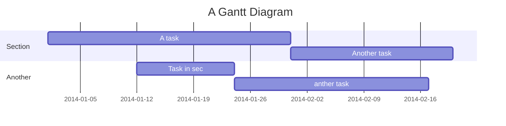

<<<<<<< HEAD
# NestJS Shared Library

A comprehensive shared library for building NestJS microservices with built-in logging, configuration management, Redis integration, OpenTelemetry observability, rate limiting, and task scheduling capabilities.

## Table of Contents

- [Overview](#overview)
- [Features](#features)
- [Installation](#installation)
- [Quick Start](#quick-start)
- [Configuration](#configuration)
- [Modules](#modules)
- [Usage Examples](#usage-examples)
- [Monitoring & Observability](#monitoring--observability)
- [Contributing](#contributing)

## Overview

This shared library provides a robust foundation for NestJS microservices with enterprise-grade features including:

- **Configuration Management**: Type-safe configuration with YAML support and validation
- **Logging**: Winston-based logging with multiple transports (Console, File, Slack, Azure, OpenTelemetry)
- **Redis Integration**: Redis client with connection pooling and rate limiting
- **Task Scheduling**: Cron jobs and interval-based task scheduling
- **Rate Limiting**: Redis-backed rate limiting with decorators and guards
- **Observability**: OpenTelemetry integration with metrics and distributed tracing
- **Statistics**: Application performance monitoring and Bull queue integration

## Features

### ✅ Core Infrastructure
- Global configuration management with environment-specific overrides
- Centralized logging with request anonymization
- Redis client with multiple database support
- Task scheduler with cron and interval support
- Rate limiting with IP-based and custom key strategies

### ✅ Observability & Monitoring
- OpenTelemetry integration (Node SDK & Azure Monitor)
- Prometheus metrics export
- Distributed tracing
- Custom metrics collection
- Grafana dashboard support

### ✅ Developer Experience
- Type-safe configuration classes
- Decorator-based rate limiting
- Retry transaction decorator
- Comprehensive error handling
- Async Local Storage context management

## Installation

\`\`\`bash
npm install @your-org/shared-lib
\`\`\`

## Quick Start

### 1. Basic App Setup

\`\`\`typescript
// app.module.ts
import { Module } from '@nestjs/common';
import { 
  InfrastructureModule, 
  ConfigModule, 
  LoggerModule,
  InfrastructureConfig,
  SettingsConfig 
} from '@your-org/shared-lib';

@Module({
  imports: [
    // Configuration with validation
    ConfigModule.forRoot({
      configs: [InfrastructureConfig, SettingsConfig]
    }),
    
    // Global logging
    LoggerModule,
    
    // Infrastructure services
    InfrastructureModule.registerAsync({
      useFactory: () => ({
        // Infrastructure options
      })
    }),
  ],
})
export class AppModule {}
\`\`\`

### 2. Configuration Files

Create configuration files in your project:

\`\`\`yaml
# apps/{PROJECT_ID}/configs/default.yaml
settings:
  product_name: "My Microservice"
  solution_id: "my-solution"
  project_id: "my-project"
  project_unique_id: "unique-id"
  worker_count: 1
  region: "us"

infrastructure:
  databases:
    redis:
      enabled: true
      hostname: "localhost"
      port: 6379
      db: 0
      use_tls: false
  
  opentelemetry:
    enabled: true
    tracer: "node-sdk"
    
  scheduler:
    enabled: true
    
  server_stats:
    enabled: true
    
  log:
    console:
      enabled: true
    file:
      enabled: false
\`\`\`

\`\`\`yaml
# apps/{PROJECT_ID}/configs/production.yaml
infrastructure:
  databases:
    redis:
      hostname: "prod-redis.example.com"
      use_tls: true
      auth:
        password: "${REDIS_PASSWORD}"
  
  opentelemetry:
    azure_monitor:
      credentials:
        connection_string: "${AZURE_MONITOR_CONNECTION_STRING}"
\`\`\`

## Configuration

### Environment Variables

Set these environment variables:

\`\`\`bash
NODE_ENV=development
PROJECT_ID=my-project
REDIS_PASSWORD=your-redis-password
AZURE_MONITOR_CONNECTION_STRING=your-connection-string
\`\`\`

### Configuration Classes

The library uses decorator-based configuration classes:

\`\`\`typescript
@Config('Infrastructure')
export class InfrastructureConfig {
  readonly databases: DatabasesOptions;
  readonly opentelemetry: OpentelemetryOptions;
  readonly scheduler?: SchedulerOptions;
  readonly server_stats?: ServerStatsOptions;
  readonly log: LogConfig;
}

@Config('Settings')
export class SettingsConfig {
  readonly product_name: string;
  readonly solution_id: string;
  readonly project_id: string;
  readonly project_unique_id: string;
  readonly worker_count: number;
  readonly region: string;
}
\`\`\`

## Modules

### InfrastructureModule

The main module that provides all infrastructure services:

\`\`\`typescript
@Module({
  imports: [
    InfrastructureModule.registerAsync({
      useFactory: () => ({
        // Optional configuration
      })
    })
  ]
})
export class AppModule {}
\`\`\`

**Exports:**
- `METRICS_SERVICE` - Metrics collection service
- `TRACE_SERVICE` - Distributed tracing service  
- `SCHEDULER_SERVICE` - Task scheduling service
- `STATS_SERVICE` - Application statistics service
- `REDIS_SERVICE` - Redis client service

### ConfigModule

Type-safe configuration management:

\`\`\`typescript
// Global configuration
ConfigModule.forRoot({
  configs: [InfrastructureConfig, SettingsConfig]
})

// Feature-specific configuration
ConfigModule.forFeature([MyFeatureConfig])
\`\`\`

### LoggerModule

Winston-based logging with multiple transports:

\`\`\`typescript
@Module({
  imports: [LoggerModule]
})
export class AppModule {}
\`\`\`

**Features:**
- HTTP request logging with anonymization
- Multiple transports (Console, File, Slack, Azure, OpenTelemetry)
- Structured logging with context

## Usage Examples

### 1. Logging

\`\`\`typescript
import { Inject, Injectable } from '@nestjs/common';
import { LoggerKey, Logger } from '@your-org/shared-lib';

@Injectable()
export class UserService {
  constructor(
    @Inject(LoggerKey) private readonly logger: Logger
  ) {}

  async createUser(userData: any) {
    this.logger.info('Creating user', { 
      sourceClass: 'UserService',
      props: { userId: userData.id }
    });
    
    try {
      // User creation logic
      this.logger.info('User created successfully', {
        sourceClass: 'UserService',
        props: { userId: userData.id }
      });
    } catch (error) {
      this.logger.error('Failed to create user', {
        sourceClass: 'UserService',
        props: { userId: userData.id, error: error.message }
      });
      throw error;
    }
  }
}
\`\`\`

### 2. Rate Limiting

\`\`\`typescript
import { Controller, Get, UseGuards } from '@nestjs/common';
import { RateLimiterGuard } from '@your-org/shared-lib';

@Controller('api')
export class ApiController {
  
  @Get('data')
  @UseGuards(RateLimiterGuard)
  async getData() {
    return { message: 'Rate limited endpoint' };
  }
}
\`\`\`

### 3. Redis Service

\`\`\`typescript
import { Inject, Injectable } from '@nestjs/common';
import { REDIS_SERVICE, IRedisClient } from '@your-org/shared-lib';

@Injectable()
export class CacheService {
  constructor(
    @Inject(REDIS_SERVICE) private readonly redis: IRedisClient
  ) {}

  async setCache(key: string, value: any, ttl: number = 3600) {
    const client = this.redis.getClient();
    await client.setex(key, ttl, JSON.stringify(value));
  }

  async getCache(key: string) {
    const client = this.redis.getClient();
    const value = await client.get(key);
    return value ? JSON.parse(value) : null;
  }
}
\`\`\`

### 4. Task Scheduling

\`\`\`typescript
import { Inject, Injectable } from '@nestjs/common';
import { SCHEDULER_SERVICE, IScheduler } from '@your-org/shared-lib';

@Injectable()
export class TaskService {
  constructor(
    @Inject(SCHEDULER_SERVICE) private readonly scheduler: IScheduler
  ) {}

  async scheduleBackup() {
    // Schedule daily backup at 2 AM
    await this.scheduler.addCronJob(
      'daily-backup',
      '0 2 * * *',
      async () => {
        console.log('Running daily backup...');
        // Backup logic here
      }
    );
  }

  async scheduleOneTimeTask() {
    // Schedule task to run in 5 minutes
    await this.scheduler.addDelayedJob(
      'cleanup-task',
      5 * 60 * 1000, // 5 minutes in milliseconds
      async () => {
        console.log('Running cleanup task...');
        // Cleanup logic here
      }
    );
  }
}
\`\`\`

### 5. Retry Transaction Decorator

\`\`\`typescript
import { Injectable } from '@nestjs/common';
import { RetryTransaction } from '@your-org/shared-lib';

@Injectable()
export class PaymentService {
  
  @RetryTransaction('processPayment', {
    maxRetries: 3,
    delay: 1000,
    backoff: 'exponential'
  })
  async processPayment(paymentData: any) {
    // Payment processing logic that might fail
    // Will be retried up to 3 times with exponential backoff
    return await this.externalPaymentAPI.charge(paymentData);
  }
}
\`\`\`

### 6. Metrics Collection

\`\`\`typescript
import { Inject, Injectable } from '@nestjs/common';
import { METRICS_SERVICE, IMetric } from '@your-org/shared-lib';

@Injectable()
export class OrderService {
  constructor(
    @Inject(METRICS_SERVICE) private readonly metrics: IMetric
  ) {}

  async processOrder(order: any) {
    // Increment order counter
    this.metrics.incrementCounter('orders_processed_total', {
      status: 'started',
      product: order.product
    });

    const startTime = Date.now();
    
    try {
      // Process order logic
      await this.processOrderLogic(order);
      
      // Record processing time
      this.metrics.recordHistogram('order_processing_duration_ms', 
        Date.now() - startTime, {
          status: 'success',
          product: order.product
        }
      );
      
      this.metrics.incrementCounter('orders_processed_total', {
        status: 'success',
        product: order.product
      });
      
    } catch (error) {
      this.metrics.incrementCounter('orders_processed_total', {
        status: 'error',
        product: order.product
      });
      throw error;
    }
  }
}
\`\`\`

### 7. Distributed Tracing

\`\`\`typescript
import { Inject, Injectable } from '@nestjs/common';
import { TRACE_SERVICE, ITracer } from '@your-org/shared-lib';

@Injectable()
export class UserService {
  constructor(
    @Inject(TRACE_SERVICE) private readonly tracer: ITracer
  ) {}

  async getUserProfile(userId: string) {
    const span = this.tracer.startSpan('getUserProfile');
    span.setAttributes({
      'user.id': userId,
      'operation': 'getUserProfile'
    });

    try {
      // Add events to trace
      span.addEvent('Fetching user from database');
      const user = await this.userRepository.findById(userId);
      
      span.addEvent('Fetching user preferences');
      const preferences = await this.preferencesService.getByUserId(userId);
      
      span.setAttributes({
        'user.found': !!user,
        'preferences.count': preferences.length
      });
      
      return { user, preferences };
      
    } catch (error) {
      span.recordException(error);
      span.setStatus({ code: 2, message: error.message }); // ERROR status
      throw error;
    } finally {
      span.end();
    }
  }
}
\`\`\`

## Monitoring & Observability

### Grafana Integration

The library includes pre-configured Grafana dashboards:

\`\`\`bash
# Start Grafana with OpenTelemetry and Prometheus
docker run -d \
  -p 3000:3000 \
  -v ./grafana:/etc/grafana/provisioning \
  grafana/grafana
\`\`\`

### OpenTelemetry Configuration

\`\`\`yaml
# Configuration for OpenTelemetry
infrastructure:
  opentelemetry:
    enabled: true
    tracer: "node-sdk"
    
    instrumentations:
      http:
        enabled: true
      redis:
        enabled: true
      postgresql:
        enabled: true
    
    node_sdk:
      metrics:
        exporter: "prometheus"
        prometheus:
          enabled: true
          hostname: "localhost"
          port: 9090
      
      tracers:
        otel_collector:
          enabled: true
          hostname: "localhost"
          port: 4318
          path: "/v1/traces"
\`\`\`

### Custom Metrics

The library automatically collects:

- **HTTP Request Metrics**: Request duration, status codes, routes
- **Process Metrics**: CPU usage, memory consumption, event loop lag
- **Redis Metrics**: Connection pool status, command latencies
- **Custom Business Metrics**: Via the metrics service

### Available Endpoints

- `GET /stats` - Application statistics and health metrics
- `GET /metrics` - Prometheus metrics endpoint (when enabled)

## Error Handling

The library provides comprehensive error classes:

\`\`\`typescript
import { 
  BackendError, 
  RateLimiterError, 
  RedisError, 
  TransactionError 
} from '@your-org/shared-lib';

// Custom error handling
try {
  await someOperation();
} catch (error) {
  if (error instanceof RateLimiterError) {
    // Handle rate limit exceeded
  } else if (error instanceof RedisError) {
    // Handle Redis connection issues
  }
  throw error;
}
\`\`\`

## Best Practices

### 1. Configuration Management
- Use environment-specific YAML files
- Validate all configuration with decorators
- Keep sensitive data in environment variables

### 2. Logging
- Use structured logging with context
- Include relevant metadata in log entries
- Respect user privacy with anonymization

### 3. Rate Limiting
- Apply rate limiting to public APIs
- Use custom key generators for user-specific limits
- Monitor rate limit metrics

### 4. Monitoring
- Instrument critical business operations
- Use distributed tracing for complex workflows
- Set up alerts on key metrics

### 5. Error Handling
- Use specific error types
- Include context in error messages
- Implement retry logic for transient failures

## Contributing

1. Fork the repository
2. Create a feature branch
3. Make your changes
4. Add tests for new functionality
5. Submit a pull request

## License

This project is licensed under the MIT License.
=======
---
title: Project documentation template
tags: [Templates, Documentation]

---

---
title: 'Project documentation template'
disqus: hackmd
---

Project Title
===


## Table of Contents

[TOC]

## Beginners Guide

If you are a total beginner to this, start here!

1. Visit hackmd.io
2. Click "Sign in"
3. Choose a way to sign in
4. Start writing note!

User story
---

```gherkin=
Feature: Guess the word

  # The first example has two steps
  Scenario: Maker starts a game
    When the Maker starts a game
    Then the Maker waits for a Breaker to join

  # The second example has three steps
  Scenario: Breaker joins a game
    Given the Maker has started a game with the word "silky"
    When the Breaker joins the Maker's game
    Then the Breaker must guess a word with 5 characters
```
> I choose a lazy person to do a hard job. Because a lazy person will find an easy way to do it. [name=Bill Gates]


```gherkin=
Feature: Shopping Cart
  As a Shopper
  I want to put items in my shopping cart
  Because I want to manage items before I check out

  Scenario: User adds item to cart
    Given I'm a logged-in User
    When I go to the Item page
    And I click "Add item to cart"
    Then the quantity of items in my cart should go up
    And my subtotal should increment
    And the warehouse inventory should decrement
```

> Read more about Gherkin here: https://docs.cucumber.io/gherkin/reference/

User flows
---
```sequence
Alice->Bob: Hello Bob, how are you?
Note right of Bob: Bob thinks
Bob-->Alice: I am good thanks!
Note left of Alice: Alice responds
Alice->Bob: Where have you been?
```

> Read more about sequence-diagrams here: http://bramp.github.io/js-sequence-diagrams/

Project Timeline
---


> Read more about mermaid here: http://mermaid-js.github.io/mermaid/

## Appendix and FAQ

:::info
**Find this document incomplete?** Leave a comment!
:::

###### tags: `Templates` `Documentation`
>>>>>>> 60c8ab4993fc29de560d701c7bfd67ed603bf622
